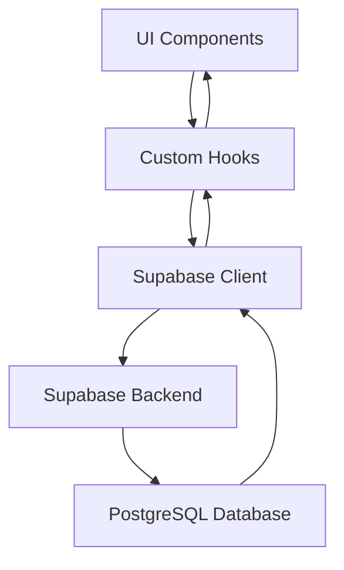
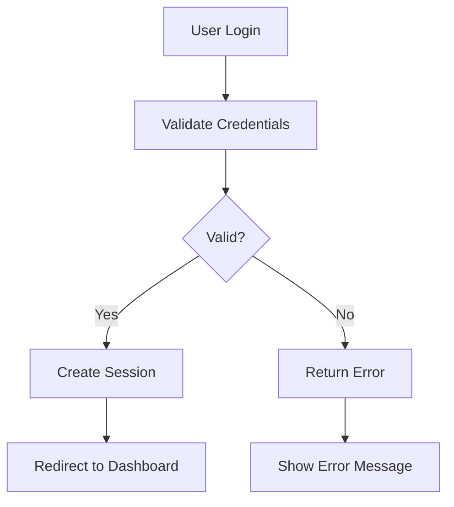
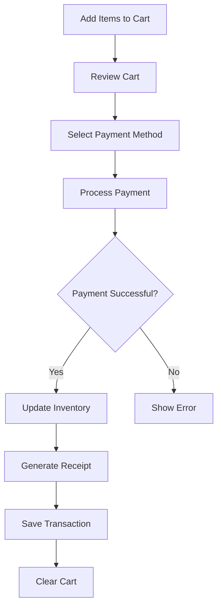
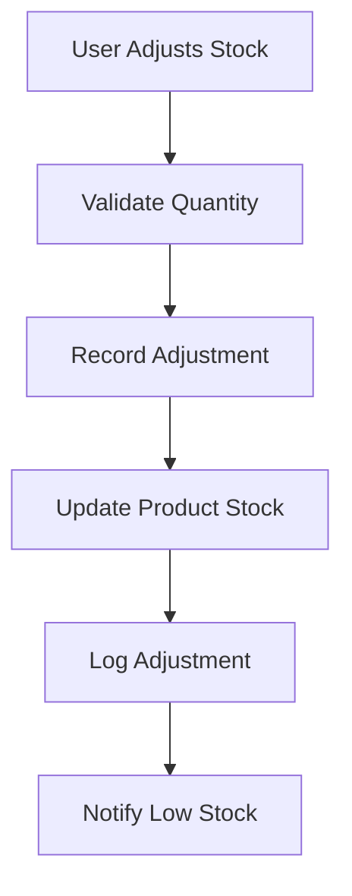

# TinderaWebPedlerV0 - Web App Development Plan

## 1. Overview

TinderaWebPedlerV0 is a Point of Sale (POS) web application designed for small retailers and peddlers. The application provides essential functionality for managing inventory, processing sales transactions, and tracking business operations through a mobile-first responsive design.

The current implementation includes:
- Product management with multi-unit support
- Inventory tracking with real-time updates
- POS transaction processing with multiple payment methods
- Category management
- Basic dashboard with navigation

However, several key features from the comprehensive PRD are still pending implementation. This document outlines the remaining work needed to complete the web app end-to-end.

### 1.1 Project Goals
1. Complete all features outlined in the Comprehensive PRD
2. Implement role-based access control for different user types
3. Add customer management with credit tracking
4. Implement advanced reporting and analytics
5. Add supplier and purchase order management
6. Enable multi-location support
7. Integrate barcode scanning functionality
8. Implement offline-first capabilities

## 2. Current Architecture

### 2.1 Technology Stack
- **Frontend**: Next.js 15.2.4, React 19, TypeScript
- **UI Components**: shadcn/ui (Radix UI primitives), Tailwind CSS
- **State Management**: React Hooks, Custom Hooks
- **Backend**: Supabase (PostgreSQL, Auth, Functions)
- **Styling**: Tailwind CSS
- **Deployment**: Vercel, Netlify

### 2.2 Component Architecture
The application follows a component-based architecture with the following key components:
- **Dashboard**: Main navigation hub
- **POS Screen**: Point of sale transaction processing
- **Inventory Screen**: Inventory management and tracking
- **Products Screen**: Product catalog management
- **Add Product**: Product creation form with multi-unit support

### 2.3 Data Flow


## 3. Implemented Features

### 3.1 Authentication & User Management
- Basic authentication system with login/logout functionality
- User profile management

### 3.2 Product Management
- Add/edit/delete products
- Multi-unit configuration (base unit + up to 6 additional units)
- Product categorization
- Stock management

### 3.3 Inventory Management
- Real-time inventory tracking
- Stock level monitoring
- Manual stock adjustments

### 3.4 POS Transaction Flow
- Product selection interface
- Cart management
- Multiple payment methods (cash, credit, card, GCash, PayMaya, GrabPay)
- Multi-payment support
- Receipt generation
- Automatic stock updates

## 4. Pending Features for Completion

### 4.1 Advanced Authentication & RBAC
**Status**: Partially implemented
**Requirements**:
- Role-based access control (Admin, Manager, Cashier, Inventory)
- Social login options (Google, Facebook)
- Password reset functionality
- Session management

**Current Implementation Status**:
The authentication system has already been partially implemented with the following components:

1. **Database Schema**: The `user_profiles` and `locations` tables have been defined in the `001_auth_system.sql` migration file and include all necessary fields for user management and RBAC.

2. **Authentication Hooks**: The `useAuth` hook in `lib/hooks/useAuth.ts` provides:
   - User sign-in functionality
   - User sign-up with profile creation
   - Session management
   - User profile fetching and updating
   - Role-based access control helpers

3. **UI Components**: The `LoginScreen` and `RegisterScreen` components in `components/auth/` provide:
   - Email/password authentication
   - Registration with role selection
   - Demo account access for testing

4. **AuthGuard Component**: The `AuthGuard` component in `components/auth/AuthGuard.tsx` provides:
   - Route protection
   - Role-based access control
   - Permission checking

**Implementation Details**:
- Create `user_roles` table with permissions mapping
- Implement middleware for route protection
- Add role-based navigation filtering
- Create admin panel for user management

### 4.2 Customer Management
**Status**: Schema exists, UI missing
**Requirements**:
- Customer database with contact information
- Credit tracking and management
- Payment history
- Customer segmentation

**Implementation Details**:
- Create customer management UI components
- Implement customer search and filtering
- Add credit limit management
- Create customer transaction history view

### 4.3 Advanced Reporting & Analytics
**Status**: Functions exist, UI missing
**Requirements**:
- Sales analytics dashboard
- Inventory reports
- Profit margin analysis
- Custom report generation

**Implementation Details**:
- Create dashboard with analytics widgets
- Implement chart components for data visualization
- Add date range filtering for reports
- Create export functionality for reports

### 4.4 Supplier & Purchase Order Management
**Status**: Schema exists, UI missing
**Requirements**:
- Supplier database management
- Purchase order creation and tracking
- Goods receiving workflow
- Invoice matching

**Implementation Details**:
- Create supplier management interface
- Implement PO creation workflow
- Add goods receiving confirmation
- Create supplier performance metrics

### 4.5 Multi-Location Support
**Status**: Schema exists, UI missing
**Requirements**:
- Location management
- Location-specific inventory
- Inter-store transfers
- Consolidated reporting

**Implementation Details**:
- Create location management UI
- Implement location-based data filtering
- Add transfer request workflow
- Create consolidated reporting dashboard

### 4.6 Barcode Integration
**Status**: Not implemented
**Requirements**:
- Barcode scanning for product lookup
- Barcode generation for products
- Inventory counting via barcode

**Implementation Details**:
- Integrate barcode scanning library
- Create barcode generation functionality
- Implement inventory counting workflow
- Add barcode printing capabilities

### 4.7 Offline Functionality
**Status**: Partially implemented
**Requirements**:
- Full offline operation capability
- Data synchronization when online
- Conflict resolution mechanisms

**Implementation Details**:
- Implement local data caching strategy
- Add offline transaction queue
- Create sync conflict resolution logic
- Add offline status indicators

## 5. Detailed Implementation Plan

### 5.1 Phase 1: Enhanced Authentication & User Management
**Timeline**: 3-5 days

**Approach**:
1. Test the current authentication implementation to ensure it works correctly
2. Add missing database type definitions for user_profiles and locations tables
3. Apply database migrations if not already applied
4. Extend the existing authentication system with role-based access control
5. Create a user management interface for admins
6. Implement social login using Supabase Auth providers
7. Add password reset functionality with email verification
8. Enhance session management with timeout and activity tracking

**Database Migration**:
Before implementing the enhanced authentication system, we need to ensure the database schema is up to date. The `001_auth_system.sql` migration file already contains the necessary table definitions for `user_profiles` and `locations`, but we need to ensure it's been applied to the database.

To check if the migration has been applied:
```bash
npx supabase migration list
```

To apply the migration:
```bash
npx supabase migration up
```

If the migration hasn't been applied yet, we'll need to create a new migration file with the missing table definitions as documented in section 12.1.

**Testing Current Implementation**:
Before proceeding with enhancements, we should test the current authentication implementation:
1. Start the development server: `pnpm dev`
2. Access the application at http://localhost:3000
3. Test login functionality with existing users:
   - Admin: admin@demo.com / demo123
   - Cashier: cashier@demo.com / demo123
4. Verify that the user profile is correctly fetched
5. Check that role-based access controls are working

If there are any issues with the current implementation, they should be resolved before proceeding with enhancements.

**Database Type Definitions**:
The database types file (`types/database.ts`) is missing the definitions for the `user_profiles` and `locations` tables. These need to be added to ensure type safety throughout the application. Refer to section 13 for the required type definitions.

**Testing Current Implementation**:
Before proceeding with enhancements, we should test the current authentication implementation:
1. Start the development server: `pnpm dev`
2. Access the application at http://localhost:3000
3. Test login functionality with existing users
4. Verify that the user profile is correctly fetched
5. Check that role-based access controls are working

If there are any issues with the current implementation, they should be resolved before proceeding with enhancements.

#### Tasks:
1. Implement role-based access control
   - Create user roles table
   - Implement permission checking in components
   - Update navigation based on user roles
   - Add role-based feature flags

2. Add social login options
   - Integrate Google OAuth
   - Integrate Facebook login
   - Handle authentication callbacks
   - Store user provider information

3. Implement password reset functionality
   - Create password reset request form
   - Implement email sending mechanism
   - Create password reset page
   - Add password strength validation

4. Enhance session management
   - Implement session timeout
   - Add "Remember me" functionality
   - Create session activity tracking
   - Add automatic logout on inactivity

### 5.2 Phase 2: Customer Management System
**Timeline**: 4-6 days

**Approach**:
1. Create comprehensive customer management interface
2. Implement credit tracking and limit management
3. Add payment history and outstanding balance tracking
4. Enable customer segmentation for marketing purposes

#### Tasks:
1. Create customer management UI
   - Customer list view with sorting and pagination
   - Customer detail view with transaction history
   - Add/edit customer forms with validation
   - Customer search and filtering by name, phone, email

2. Implement credit tracking
   - Credit balance display on customer profile
   - Credit transaction history with dates and amounts
   - Credit limit management with alerts
   - Credit payment processing integration

3. Add payment history tracking
   - Transaction history per customer with details
   - Payment method tracking and preferences
   - Outstanding balance calculation and display
   - Payment reminder functionality

### 5.3 Phase 3: Advanced Reporting & Analytics
**Timeline**: 5-7 days

**Approach**:
1. Create comprehensive analytics dashboard with real-time data
2. Implement detailed reporting with export capabilities
3. Add interactive data visualizations for better insights
4. Enable custom report creation and scheduling

#### Tasks:
1. Create analytics dashboard
   - Sales overview widgets with KPIs
   - Top selling products with ranking
   - Revenue trends with comparison periods
   - Inventory status indicators with low stock alerts
   - Customer metrics and retention analysis

2. Implement detailed reports
   - Sales reports by date range with filtering
   - Inventory movement reports with cost analysis
   - Customer purchase history with lifetime value
   - Profit and loss statements with margin calculations
   - Staff performance reports

3. Add data visualization
   - Interactive charts for sales trends over time
   - Pie charts for product distribution and category breakdown
   - Bar graphs for category performance comparison
   - Heatmaps for peak sales periods
   - Export functionality for all reports (PDF, CSV, Excel)

### 5.4 Phase 4: Supplier & Purchase Order Management
**Timeline**: 4-6 days

**Approach**:
1. Create comprehensive supplier database with contact management
2. Implement end-to-end purchase order workflow
3. Add goods receiving and quality control processes
4. Enable supplier performance tracking and reporting

#### Tasks:
1. Create supplier management
   - Supplier list view with search and filtering
   - Supplier detail view with contact information
   - Add/edit supplier forms with validation
   - Supplier contact management with communication history
   - Supplier categorization and performance metrics

2. Implement purchase order system
   - PO creation workflow with product selection
   - Multi-level PO approval process
   - Goods receiving interface with quantity verification
   - Invoice matching functionality with discrepancy reporting
   - Supplier payment tracking and history

### 5.5 Phase 5: Multi-Location Support
**Timeline**: 5-7 days

**Approach**:
1. Create location management system with hierarchical structure
2. Implement location-based data isolation and access control
3. Add inter-store transfer and inventory sharing capabilities
4. Enable consolidated reporting with location filtering

#### Tasks:
1. Implement location management
   - Location creation and configuration with address details
   - Location settings management (tax rates, currency, etc.)
   - Staff assignment to locations with role management
   - Location hierarchy support (regions, districts, stores)
   - Location performance metrics and KPIs

2. Add location-specific features
   - Location-based inventory tracking with separate stock levels
   - Inter-store transfer functionality with approval workflow
   - Location-specific pricing and promotions
   - Consolidated reporting across locations with comparison
   - Centralized inventory management across all locations

### 5.6 Phase 6: Barcode Integration
**Timeline**: 3-5 days

**Approach**:
1. Integrate barcode scanning capabilities for mobile and desktop
2. Implement barcode generation for products and inventory
3. Add inventory counting workflow with barcode scanning
4. Enable receipt printing with QR codes for easy access

#### Tasks:
1. Implement barcode scanning
   - Product lookup by barcode with camera integration
   - Inventory counting via barcode with batch processing
   - Quick add to cart functionality in POS
   - Barcode scanning in inventory management
   - Error handling for unrecognized barcodes

2. Add barcode generation
   - Product barcode creation with multiple formats (Code128, EAN, UPC)
   - Custom label printing with product information
   - QR code generation for receipts and product details
   - Batch barcode generation for inventory items
   - Barcode printing templates with customization options

### 5.7 Phase 7: Offline Functionality
**Timeline**: 4-6 days

**Approach**:
1. Implement robust offline data storage with automatic synchronization
2. Enable full transaction processing while offline
3. Add conflict resolution for data synchronization
4. Provide user feedback on offline status and sync progress

#### Tasks:
1. Implement offline data storage
   - Local storage for critical data (products, categories)
   - IndexedDB for complex data structures (transactions, customers)
   - Data synchronization mechanisms with conflict detection
   - Offline data encryption for security
   - Storage quota management and cleanup

2. Add offline transaction processing
   - Queue transactions for later processing with unique identifiers
   - Conflict resolution for data synchronization with timestamps
   - User notifications for sync status and completion
   - Manual sync trigger for user control
   - Offline transaction history and status tracking

## 6. Data Models & ORM Mapping

### 6.1 Enhanced User Model
```typescript
interface User {
  id: string
  email: string
  full_name: string
  role: 'admin' | 'manager' | 'cashier' | 'inventory'
  location_id: string | null
  is_active: boolean
  created_at: string
  updated_at: string
}
```

### 6.2 Customer Model
```typescript
interface Customer {
  id: string
  name: string
  phone_number: string | null
  email: string | null
  address: string | null
  notes: string | null
  credit_limit: number
  current_balance: number
  total_purchases: number
  last_purchase_date: string | null
  is_active: boolean
  created_at: string
  updated_at: string
}
```

### 6.3 Supplier Model
```typescript
interface Supplier {
  id: string
  name: string
  contact_info: string
  terms: string
  is_active: boolean
  created_at: string
  updated_at: string
}
```

### 6.4 Purchase Order Model
```typescript
interface PurchaseOrder {
  id: string
  supplier_id: string
  status: 'draft' | 'pending' | 'approved' | 'received' | 'cancelled'
  total: number
  created_by: string
  approved_by: string | null
  received_by: string | null
  created_at: string
  updated_at: string
}
```

### 6.5 Location Model
```typescript
interface Location {
  id: string
  name: string
  address: string
  manager_id: string | null
  settings: Json
  created_at: string
  updated_at: string
}
```

## 7. API Endpoints Reference

### 7.1 Authentication Endpoints
- `POST /auth/login` - User login
- `POST /auth/register` - User registration
- `POST /auth/reset-password` - Password reset request
- `PUT /auth/reset-password` - Password reset confirmation

### 7.2 User Management Endpoints
- `GET /users` - List all users
- `GET /users/{id}` - Get user details
- `POST /users` - Create new user
- `PUT /users/{id}` - Update user
- `DELETE /users/{id}` - Delete user

### 7.3 Customer Management Endpoints
- `GET /customers` - List all customers
- `GET /customers/{id}` - Get customer details
- `POST /customers` - Create new customer
- `PUT /customers/{id}` - Update customer
- `DELETE /customers/{id}` - Delete customer

### 7.4 Reporting Endpoints
- `GET /reports/sales-summary` - Get sales summary
- `GET /reports/inventory-status` - Get inventory status
- `GET /reports/customer-history/{id}` - Get customer purchase history
- `GET /reports/profit-loss` - Get profit and loss statement

## 8. Business Logic Layer

### 8.1 Authentication Flow


### 8.2 Transaction Processing Flow


### 8.3 Inventory Adjustment Flow


## 9. Testing Strategy

### 9.1 Unit Testing
- Test all custom hooks for data fetching and manipulation
- Test form validation logic
- Test business logic functions
- Test utility functions

### 9.2 Integration Testing
- Test API endpoint integrations
- Test database operations
- Test authentication flows
- Test transaction processing workflows

### 9.3 End-to-End Testing
- Test complete user journeys
- Test cross-component interactions
- Test error handling scenarios
- Test edge cases

## 10. Deployment & Monitoring

### 10.1 Deployment Strategy
- Continuous deployment via Vercel
- Environment-specific configurations
- Database migration management
- Rollback procedures

### 10.2 Monitoring & Analytics
- Error tracking with Sentry
- Performance monitoring
- User analytics with Plausible
- Database performance monitoring

## 11. Security Considerations

### 11.1 Data Security
- Row Level Security (RLS) policies
- Data encryption at rest and in transit
- Regular security audits
- GDPR compliance measures

### 11.2 User Security
- Multi-factor authentication
- Session management
- Password policies
- Activity logging

## 12. Database Schema Updates

To support the enhanced authentication and RBAC system, the database schema needs to be updated with the following tables:

### 12.1 User Profiles Table
```sql
CREATE TABLE user_profiles (
    id UUID PRIMARY KEY DEFAULT gen_random_uuid(),
    email TEXT UNIQUE NOT NULL,
    full_name TEXT NOT NULL,
    role TEXT NOT NULL CHECK (role IN ('admin', 'manager', 'cashier', 'inventory')),
    location_id UUID REFERENCES locations(id),
    phone TEXT,
    avatar_url TEXT,
    is_active BOOLEAN DEFAULT true,
    last_login_at TIMESTAMP WITH TIME ZONE,
    created_at TIMESTAMP WITH TIME ZONE DEFAULT NOW(),
    updated_at TIMESTAMP WITH TIME ZONE DEFAULT NOW()
);
```

### 12.2 Locations Table
```sql
CREATE TABLE locations (
    id UUID PRIMARY KEY DEFAULT gen_random_uuid(),
    name TEXT NOT NULL,
    address TEXT,
    phone TEXT,
    email TEXT,
    manager_id UUID REFERENCES user_profiles(id),
    settings JSONB DEFAULT '{}',
    is_active BOOLEAN DEFAULT true,
    created_at TIMESTAMP WITH TIME ZONE DEFAULT NOW(),
    updated_at TIMESTAMP WITH TIME ZONE DEFAULT NOW()
);
```

## 13. Type Definitions Update

The database types file (`types/database.ts`) needs to be updated to include the new tables. Currently, the `user_profiles` and `locations` tables are defined in the database schema but are missing from the TypeScript type definitions. Adding these definitions will ensure type safety throughout the application.

```typescript
user_profiles: {
  Row: {
    id: string
    email: string
    full_name: string
    role: 'admin' | 'manager' | 'cashier' | 'inventory'
    location_id: string | null
    phone: string | null
    avatar_url: string | null
    is_active: boolean
    last_login_at: string | null
    created_at: string
    updated_at: string
  }
  Insert: {
    id?: string
    email: string
    full_name: string
    role?: 'admin' | 'manager' | 'cashier' | 'inventory'
    location_id?: string | null
    phone?: string | null
    avatar_url?: string | null
    is_active?: boolean
    last_login_at?: string | null
    created_at?: string
    updated_at?: string
  }
  Update: {
    id?: string
    email?: string
    full_name?: string
    role?: 'admin' | 'manager' | 'cashier' | 'inventory'
    location_id?: string | null
    phone?: string | null
    avatar_url?: string | null
    is_active?: boolean
    last_login_at?: string | null
    created_at?: string
    updated_at?: string
  }
}

locations: {
  Row: {
    id: string
    name: string
    address: string | null
    phone: string | null
    email: string | null
    manager_id: string | null
    settings: Json
    is_active: boolean
    created_at: string
    updated_at: string
  }
  Insert: {
    id?: string
    name: string
    address?: string | null
    phone?: string | null
    email?: string | null
    manager_id?: string | null
    settings?: Json
    is_active?: boolean
    created_at?: string
    updated_at?: string
  }
  Update: {
    id?: string
    name?: string
    address?: string | null
    phone?: string | null
    email?: string | null
    manager_id?: string | null
    settings?: Json
    is_active?: boolean
    created_at?: string
    updated_at?: string
  }
}
```

## 14. Immediate Next Steps

Based on our analysis of the current implementation, here are the immediate next steps to proceed with building and finishing the web app end-to-end:

1. **Test Current Authentication Implementation**:
   - Start the development server: `pnpm dev`
   - Access the application at http://localhost:3000
   - Test login functionality with existing demo users
   - Verify that the user profile is correctly fetched
   - Check that role-based access controls are working

2. **Apply Database Migrations** (if not already applied):
   - Check migration status: `npx supabase migration list`
   - Apply migrations: `npx supabase migration up`

3. **Add Missing Database Type Definitions**:
   - Update `types/database.ts` to include `user_profiles` and `locations` table definitions

4. **Implement Enhanced Authentication Features**:
   - Create user management interface for admins
   - Implement social login using Supabase Auth providers
   - Add password reset functionality with email verification
   - Enhance session management with timeout and activity tracking

## 15. Conclusion

The TinderaWebPedlerV0 application has a solid foundation with core POS functionality already implemented. By following this implementation plan, the application can be enhanced to become a comprehensive business management solution that addresses all the requirements outlined in the Comprehensive PRD.

The phased approach ensures that critical functionality is delivered incrementally, allowing for user feedback and testing at each stage. The implementation leverages the existing Supabase backend and React/Next.js frontend architecture, minimizing technical debt while extending functionality.

With the completion of all planned features, TinderaWebPedlerV0 will provide small retailers and peddlers with a powerful, mobile-first solution for managing their business operations efficiently and effectively.